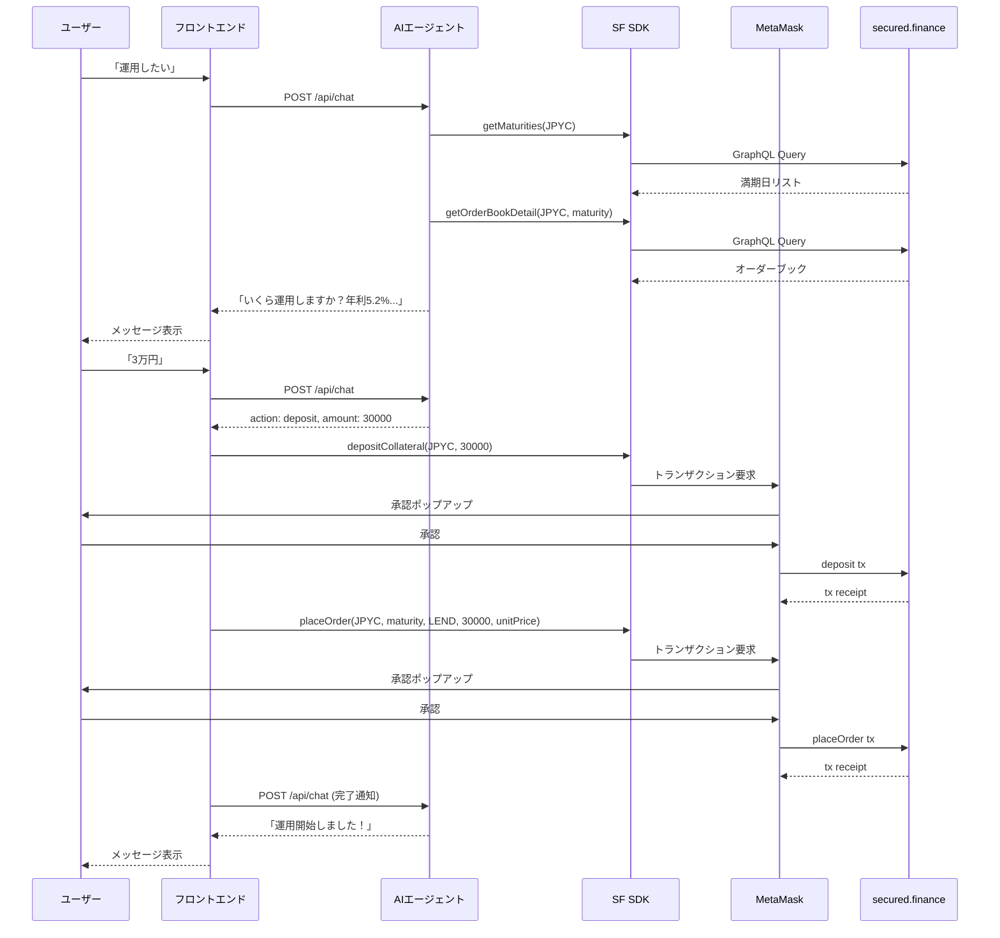
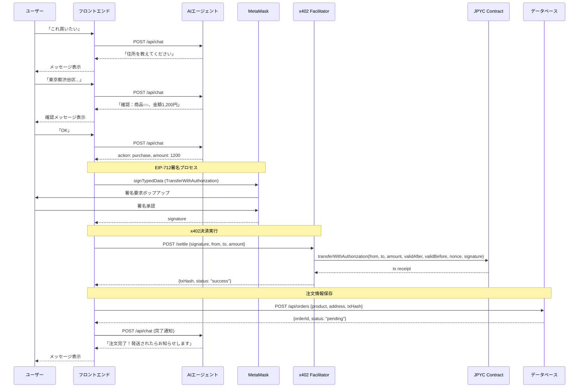

# 機能設計書

## 1. システム構成図

```
┌─────────────────────────────────────────────────────────────────────────┐
│                              ユーザー                                    │
│                          (ブラウザ/モバイル)                              │
└─────────────────────────────────────────────────────────────────────────┘
                                    │
                                    ▼
┌─────────────────────────────────────────────────────────────────────────┐
│                         フロントエンド (Next.js)                         │
│  ┌──────────────┐  ┌──────────────┐  ┌──────────────┐                  │
│  │  チャットUI   │  │ ウォレット   │  │  商品カード  │                  │
│  │              │  │  接続UI     │  │   表示UI    │                  │
│  └──────────────┘  └──────────────┘  └──────────────┘                  │
│                                                                         │
│  ┌──────────────────────────────────────────────────────────────────┐  │
│  │                    Wagmi / Viem (ウォレット連携)                   │  │
│  └──────────────────────────────────────────────────────────────────┘  │
└─────────────────────────────────────────────────────────────────────────┘
                                    │
                    ┌───────────────┼───────────────┐
                    ▼               ▼               ▼
┌──────────────────────┐ ┌──────────────────┐ ┌──────────────────────┐
│   バックエンド API    │ │   ブロックチェーン │ │   外部サービス        │
│   (Next.js API Routes)│ │                  │ │                      │
│                      │ │ ┌──────────────┐ │ │ ┌──────────────────┐ │
│ ┌──────────────────┐ │ │ │secured.finance│ │ │ │   楽天市場 API    │ │
│ │  AIエージェント   │ │ │ │  (DeFi)      │ │ │ │                  │ │
│ │  (Claude API)    │ │ │ └──────────────┘ │ │ └──────────────────┘ │
│ └──────────────────┘ │ │                  │ │                      │
│                      │ │ ┌──────────────┐ │ │ ┌──────────────────┐ │
│ ┌──────────────────┐ │ │ │ x402         │ │ │ │  OpenAI/Claude   │ │
│ │   注文管理       │ │ │ │ Facilitator  │ │ │ │     API          │ │
│ │                  │ │ │ └──────────────┘ │ │ └──────────────────┘ │
│ └──────────────────┘ │ │                  │ │                      │
└──────────────────────┘ │ ┌──────────────┐ │ └──────────────────────┘
          │              │ │  JPYC Token  │ │
          ▼              │ │  Contract    │ │
┌──────────────────────┐ │ └──────────────┘ │
│    データベース       │ └──────────────────┘
│    (PostgreSQL)      │
│                      │
│ ・注文情報           │
│ ・会話履歴           │
│ ・ユーザー情報       │
└──────────────────────┘
```

## 2. 機能アーキテクチャ

### 2.1 チャット機能

```
┌─────────────────────────────────────────────────────────────┐
│                      チャット機能                            │
├─────────────────────────────────────────────────────────────┤
│                                                             │
│  ユーザー入力                                                │
│       │                                                     │
│       ▼                                                     │
│  ┌─────────────┐                                           │
│  │ 意図分類     │ ← AIエージェント                          │
│  └─────────────┘                                           │
│       │                                                     │
│       ├──────────────┬──────────────┬──────────────┐       │
│       ▼              ▼              ▼              ▼       │
│  ┌─────────┐   ┌─────────┐   ┌─────────┐   ┌─────────┐   │
│  │運用関連  │   │購入関連  │   │情報照会  │   │雑談     │   │
│  └─────────┘   └─────────┘   └─────────┘   └─────────┘   │
│       │              │              │              │       │
│       ▼              ▼              ▼              ▼       │
│  DeFi操作       商品検索       残高確認      一般応答      │
│  Deposit        住所収集       利息確認                    │
│  Withdraw       x402決済       運用状況                    │
│  Claim                                                     │
│                                                             │
└─────────────────────────────────────────────────────────────┘
```

### 2.2 DeFi連携機能（secured.finance SDK）

secured.financeはOrderbook方式の固定金利プロトコル。AIエージェントが複雑さを隠蔽し、ユーザーには「運用したい」「引き出したい」という自然な言葉でやり取りできるようにする。

```
┌─────────────────────────────────────────────────────────────┐
│                     DeFi連携機能                             │
├─────────────────────────────────────────────────────────────┤
│                                                             │
│  ┌─────────────────────────────────────────────────────┐   │
│  │              Deposit フロー（運用開始）              │   │
│  │                                                     │   │
│  │  1. ユーザー「運用したい」                           │   │
│  │  2. AI: getMaturities() で満期日を取得               │   │
│  │  3. AI: getOrderBookDetail() で最良レートを取得      │   │
│  │  4. AI「いくら運用しますか？                        │   │
│  │       現在の最良レート: 年利5.2%（3ヶ月満期）        │   │
│  │       現在の残高: 50,000 JPYC」                      │   │
│  │  5. ユーザー「3万円」                               │   │
│  │  6. AI「30,000 JPYCを年利5.2%で運用します。         │   │
│  │       3ヶ月後の予想利益: 約390円                    │   │
│  │       ウォレットで承認してください」                 │   │
│  │  7. depositCollateral() → MetaMask承認              │   │
│  │  8. placeOrder(LEND) → MetaMask承認                 │   │
│  │  9. AI「運用開始しました！ZC Bondを受け取りました」  │   │
│  └─────────────────────────────────────────────────────┘   │
│                                                             │
│  ┌─────────────────────────────────────────────────────┐   │
│  │              運用状況確認フロー                       │   │
│  │                                                     │   │
│  │  1. ユーザー「今の状況は？」                         │   │
│  │  2. AI: getPositions() でポジション取得              │   │
│  │  3. AI「現在の運用状況：                            │   │
│  │       ・運用額: 30,000 JPYC                         │   │
│  │       ・満期日: 2025/03/27                          │   │
│  │       ・予想利益: 390 JPYC（年利5.2%）              │   │
│  │       ・満期まで: あと82日」                        │   │
│  └─────────────────────────────────────────────────────┘   │
│                                                             │
│  ┌─────────────────────────────────────────────────────┐   │
│  │              Withdraw フロー（早期解消）             │   │
│  │                                                     │   │
│  │  1. ユーザー「引き出したい」                         │   │
│  │  2. AI: getPositions() で現在のポジション確認        │   │
│  │  3. AI「運用中の30,000 JPYCを引き出しますか？       │   │
│  │       ※満期前の解消のため、現在のレートで売却します │   │
│  │       予想受取額: 29,800 JPYC」                     │   │
│  │  4. ユーザー「OK」                                  │   │
│  │  5. unwindPosition() → MetaMask承認                 │   │
│  │  6. AI「引き出し完了！29,800 JPYCがウォレットに     │   │
│  │       戻りました」                                  │   │
│  └─────────────────────────────────────────────────────┘   │
│                                                             │
│  ┌─────────────────────────────────────────────────────┐   │
│  │              満期時の受け取りフロー                   │   │
│  │                                                     │   │
│  │  1. （満期日到達時）                                 │   │
│  │  2. AI: getPositions() で満期到達を検知              │   │
│  │  3. AI「満期を迎えました！利益を受け取れます。       │   │
│  │       ・元本: 30,000 JPYC                           │   │
│  │       ・利益: 390 JPYC                              │   │
│  │       ・合計: 30,390 JPYC                           │   │
│  │       受け取りますか？」                            │   │
│  │  4. ユーザー「受け取る」                            │   │
│  │  5. executeRedemption() → MetaMask承認              │   │
│  │  6. AI「受け取り完了！30,390 JPYCがウォレットに」   │   │
│  └─────────────────────────────────────────────────────┘   │
│                                                             │
└─────────────────────────────────────────────────────────────┘
```

### 2.2.1 シーケンス図（Deposit）



### 2.3 購入機能

```
┌─────────────────────────────────────────────────────────────┐
│                       購入機能                               │
├─────────────────────────────────────────────────────────────┤
│                                                             │
│  ┌─────────────────────────────────────────────────────┐   │
│  │                  商品検索フロー                       │   │
│  │                                                     │   │
│  │  1. ユーザー「チョコレートが欲しい」                  │   │
│  │  2. 楽天API検索                                     │   │
│  │  3. AI「こんな商品が見つかりました」                 │   │
│  │  4. 商品カード表示（画像・名前・価格・詳細）          │   │
│  └─────────────────────────────────────────────────────┘   │
│                                                             │
│  ┌─────────────────────────────────────────────────────┐   │
│  │               利息ショッピングフロー                  │   │
│  │                                                     │   │
│  │  1. ユーザー「利息で何か買える？」                   │   │
│  │  2. 利息額取得（secured.finance）                   │   │
│  │  3. 利息範囲内で商品検索                            │   │
│  │  4. AI「現在の利息○円で買える商品はこちら」         │   │
│  │     または                                          │   │
│  │     「3ヶ月後には○○が買えるようになります」         │   │
│  └─────────────────────────────────────────────────────┘   │
│                                                             │
│  ┌─────────────────────────────────────────────────────┐   │
│  │                  購入決定フロー                       │   │
│  │                                                     │   │
│  │  1. ユーザー「これ買いたい」                         │   │
│  │  2. AI「お届け先の住所を教えてください」             │   │
│  │  3. ユーザー「東京都渋谷区...」                      │   │
│  │  4. AI「確認：商品○○、金額○円、届け先○○」        │   │
│  │  5. ユーザー「OK」                                  │   │
│  │  6. x402でJPYC送金（MetaMask承認）                  │   │
│  │  7. 注文情報をDBに保存                              │   │
│  │  8. AI「注文完了！発送されたらお知らせします」       │   │
│  └─────────────────────────────────────────────────────┘   │
│                                                             │
└─────────────────────────────────────────────────────────────┘
```

### 2.3.1 シーケンス図（x402決済）



### 2.3.2 x402 Facilitator処理フロー

```
┌─────────────────────────────────────────────────────────────┐
│                  x402 Facilitator                           │
├─────────────────────────────────────────────────────────────┤
│                                                             │
│  1. 署名検証                                                │
│     ├─ EIP-712署名の検証                                   │
│     ├─ nonce重複チェック                                   │
│     └─ validAfter/validBefore確認                          │
│                                                             │
│  2. 残高確認                                                │
│     └─ ユーザーのJPYC残高 >= 送金額                        │
│                                                             │
│  3. トランザクション実行                                    │
│     ├─ Facilitatorの秘密鍵でガス代を負担                   │
│     └─ JPYC.transferWithAuthorization() を呼び出し          │
│                                                             │
│  4. レスポンス                                              │
│     ├─ 成功: {txHash, blockNumber}                         │
│     └─ 失敗: {error, reason}                               │
│                                                             │
└─────────────────────────────────────────────────────────────┘
```

## 3. データモデル

### 3.1 ER図

```
┌─────────────────────┐       ┌─────────────────────┐
│       users         │       │    conversations    │
├─────────────────────┤       ├─────────────────────┤
│ id (PK)             │       │ id (PK)             │
│ wallet_address      │───┐   │ user_id (FK)        │
│ created_at          │   │   │ created_at          │
│ updated_at          │   │   │ updated_at          │
└─────────────────────┘   │   └─────────────────────┘
                          │             │
                          │             │ 1:N
                          │             ▼
                          │   ┌─────────────────────┐
                          │   │      messages       │
                          │   ├─────────────────────┤
                          │   │ id (PK)             │
                          │   │ conversation_id(FK) │
                          │   │ role (user/assistant)│
                          │   │ content             │
                          │   │ metadata (JSON)     │
                          │   │ created_at          │
                          │   └─────────────────────┘
                          │             ▲
                          │             │ 1:N (注文経由の会話追跡)
                          │             │
                          │   ┌─────────────────────┐
                          │   │       orders        │
                          └──▶├─────────────────────┤
                              │ id (PK)             │
                              │ user_id (FK)        │
                              │ conversation_id(FK) │ ← 追加
                              │ product_name        │
                              │ product_image_url   │
                              │ product_url         │
                              │ price               │
                              │ shipping_address    │
                              │ shipping_postal_code│
                              │ shipping_name       │
                              │ tx_hash             │
                              │ status              │
                              │ created_at          │
                              │ updated_at          │
                              └─────────────────────┘
```

### 3.2 テーブル定義

#### users テーブル

| カラム名 | 型 | 制約 | 説明 |
|---------|-----|------|------|
| id | UUID | PK | ユーザーID |
| wallet_address | VARCHAR(42) | UNIQUE, NOT NULL | ウォレットアドレス |
| created_at | TIMESTAMP | NOT NULL | 作成日時 |
| updated_at | TIMESTAMP | NOT NULL | 更新日時 |

#### conversations テーブル

| カラム名 | 型 | 制約 | 説明 |
|---------|-----|------|------|
| id | UUID | PK | 会話ID |
| user_id | UUID | FK (users) | ユーザーID |
| created_at | TIMESTAMP | NOT NULL | 作成日時 |
| updated_at | TIMESTAMP | NOT NULL | 更新日時 |

#### messages テーブル

| カラム名 | 型 | 制約 | 説明 |
|---------|-----|------|------|
| id | UUID | PK | メッセージID |
| conversation_id | UUID | FK (conversations) | 会話ID |
| role | VARCHAR(20) | NOT NULL | user / assistant |
| content | TEXT | NOT NULL | メッセージ内容 |
| metadata | JSONB | | 追加情報（商品情報など） |
| created_at | TIMESTAMP | NOT NULL | 作成日時 |

#### orders テーブル

| カラム名 | 型 | 制約 | 説明 |
|---------|-----|------|------|
| id | UUID | PK | 注文ID |
| user_id | UUID | FK (users), NOT NULL | ユーザーID |
| conversation_id | UUID | FK (conversations) | 注文を生成した会話（追跡用） |
| product_name | VARCHAR(255) | NOT NULL | 商品名 |
| product_image_url | TEXT | | 商品画像URL |
| product_url | TEXT | NOT NULL | 楽天商品URL |
| price | INTEGER | NOT NULL | 価格（JPYC） |
| shipping_postal_code | VARCHAR(10) | NOT NULL | 郵便番号 |
| shipping_address | TEXT | NOT NULL | 住所 |
| shipping_name | VARCHAR(100) | NOT NULL | 届け先氏名 |
| tx_hash | VARCHAR(66) | | トランザクションハッシュ |
| status | VARCHAR(20) | NOT NULL, DEFAULT 'pending' | ステータス |
| created_at | TIMESTAMP | NOT NULL | 作成日時 |
| updated_at | TIMESTAMP | NOT NULL | 更新日時 |

**インデックス:**
- `idx_orders_user_id` - user_id（ユーザー別注文検索）
- `idx_orders_status` - status（ステータス別フィルタリング）
- `idx_orders_created_at` - created_at DESC（最新順ソート）

**status の値:**
- `pending`: 注文受付
- `ordered`: 発注済み
- `shipped`: 発送済み
- `completed`: 完了
- `cancelled`: キャンセル

## 4. 画面設計

### 4.1 画面一覧

| 画面ID | 画面名 | 概要 | 対象ユーザー |
|--------|--------|------|-------------|
| S-001 | チャット画面 | メインのチャットインターフェース | ユーザー |
| S-002 | 管理者ログイン | 管理者認証画面 | 管理者 |
| S-003 | 注文一覧画面 | 注文リストと管理 | 管理者 |
| S-004 | 注文詳細画面 | 注文の詳細とステータス更新 | 管理者 |

### 4.2 画面遷移図

```
                    ┌─────────────────┐
                    │   ランディング   │
                    │  （チャット画面） │
                    └────────┬────────┘
                             │
              ┌──────────────┼──────────────┐
              │              │              │
              ▼              ▼              ▼
    ┌─────────────────┐           ┌─────────────────┐
    │  ウォレット接続  │           │  管理者ログイン  │
    │   (モーダル)    │           │                 │
    └─────────────────┘           └────────┬────────┘
                                           │
                                           ▼
                                  ┌─────────────────┐
                                  │   注文一覧画面   │
                                  └────────┬────────┘
                                           │
                                           ▼
                                  ┌─────────────────┐
                                  │   注文詳細画面   │
                                  └─────────────────┘
```

### 4.3 ワイヤフレーム

#### S-001: チャット画面（モバイル）

```
┌─────────────────────────────────┐
│  JPYC Concierge    [Wallet]    │ ← ヘッダー
├─────────────────────────────────┤
│                                 │
│  ┌─────────────────────────┐   │
│  │ こんにちは！JPYCコンシェル│   │ ← AIメッセージ
│  │ ジュです。運用や買い物の  │   │
│  │ お手伝いをします。       │   │
│  └─────────────────────────┘   │
│                                 │
│         ┌─────────────────────┐ │
│         │ 運用したい         │ │ ← ユーザーメッセージ
│         └─────────────────────┘ │
│                                 │
│  ┌─────────────────────────┐   │
│  │ いくら運用しますか？     │   │
│  │ 現在の残高: 50,000 JPYC  │   │
│  └─────────────────────────┘   │
│                                 │
│  ┌─────────────────────────┐   │
│  │ 商品カード              │   │ ← 商品提案時
│  │ ┌─────┐                 │   │
│  │ │ 画像 │ ゴディバ       │   │
│  │ │     │ チョコレート    │   │
│  │ └─────┘ ¥1,200         │   │
│  │         [詳細を見る]    │   │
│  └─────────────────────────┘   │
│                                 │
├─────────────────────────────────┤
│ [メッセージを入力...]    [送信] │ ← 入力エリア
└─────────────────────────────────┘
```

#### S-001: チャット画面（デスクトップ）

```
┌──────────────────────────────────────────────────────────────────┐
│  JPYC Concierge                              [0x1234...] [切断] │
├────────────────────────────┬─────────────────────────────────────┤
│                            │                                     │
│  残高情報                  │  ┌───────────────────────────────┐ │
│  ────────────              │  │ AIメッセージ                  │ │
│  ウォレット: 50,000 JPYC   │  └───────────────────────────────┘ │
│  運用中:     30,000 JPYC   │                                     │
│  利息:          847 JPYC   │           ┌───────────────────────┐│
│                            │           │ ユーザーメッセージ    ││
│  ────────────              │           └───────────────────────┘│
│  年利: 約5%                │                                     │
│                            │  ┌───────────────────────────────┐ │
│                            │  │ 商品カード                    │ │
│                            │  │ ┌──────┐                      │ │
│                            │  │ │ 画像  │ 商品名              │ │
│                            │  │ │      │ ¥1,200              │ │
│                            │  │ └──────┘ [詳細] [購入]        │ │
│                            │  └───────────────────────────────┘ │
│                            │                                     │
│                            ├─────────────────────────────────────┤
│                            │ [メッセージを入力...]        [送信] │
└────────────────────────────┴─────────────────────────────────────┘
```

#### S-003: 注文一覧画面（管理者）

```
┌──────────────────────────────────────────────────────────────────┐
│  管理者ダッシュボード                              [ログアウト]  │
├──────────────────────────────────────────────────────────────────┤
│                                                                  │
│  注文一覧                                      [ステータス ▼]   │
│  ─────────────────────────────────────────────────────────────  │
│                                                                  │
│  ┌────────────────────────────────────────────────────────────┐ │
│  │ #001 | ゴディバ チョコ | ¥1,200 | 注文受付 | 2025/01/03   │ │
│  │ 東京都渋谷区...                              [詳細を見る]  │ │
│  └────────────────────────────────────────────────────────────┘ │
│                                                                  │
│  ┌────────────────────────────────────────────────────────────┐ │
│  │ #002 | スタバ コーヒー | ¥820 | 発注済み | 2025/01/02     │ │
│  │ 神奈川県横浜市...                            [詳細を見る]  │ │
│  └────────────────────────────────────────────────────────────┘ │
│                                                                  │
│  ┌────────────────────────────────────────────────────────────┐ │
│  │ #003 | 無印 お菓子 | ¥500 | 完了 | 2025/01/01             │ │
│  │ 大阪府大阪市...                              [詳細を見る]  │ │
│  └────────────────────────────────────────────────────────────┘ │
│                                                                  │
│                              [< 前へ] 1 / 3 [次へ >]            │
│                                                                  │
└──────────────────────────────────────────────────────────────────┘
```

#### S-004: 注文詳細画面（管理者）

```
┌──────────────────────────────────────────────────────────────────┐
│  [← 戻る] 注文詳細 #001                                          │
├──────────────────────────────────────────────────────────────────┤
│                                                                  │
│  商品情報                                                        │
│  ─────────                                                       │
│  ┌──────┐                                                       │
│  │ 画像  │  ゴディバ チョコレート詰め合わせ                     │
│  │      │  ¥1,200                                              │
│  └──────┘  [楽天で開く]                                         │
│                                                                  │
│  配送先                                                          │
│  ─────                                                           │
│  〒150-0001                                                      │
│  東京都渋谷区神宮前1-2-3                                         │
│  山田 太郎 様                                                    │
│                                                                  │
│  決済情報                                                        │
│  ─────────                                                       │
│  トランザクション: 0x1234...5678 [Etherscanで確認]              │
│  送金額: 1,200 JPYC                                             │
│  送金日時: 2025/01/03 14:30                                     │
│                                                                  │
│  ステータス更新                                                  │
│  ─────────────                                                   │
│  現在: [注文受付]                                                │
│                                                                  │
│  [注文受付] → [発注済み] → [発送済み] → [完了]                  │
│                                                                  │
│  [発注済みに変更]  [キャンセル]                                  │
│                                                                  │
└──────────────────────────────────────────────────────────────────┘
```

## 5. API設計

### 5.1 エンドポイント一覧

| メソッド | パス | 説明 | 認証 |
|---------|------|------|------|
| POST | /api/chat | チャットメッセージ送信 | Wallet |
| GET | /api/chat/history | 会話履歴取得 | Wallet |
| GET | /api/products/search | 楽天商品検索 | なし |
| POST | /api/orders | 注文作成 | Wallet |
| GET | /api/orders | 注文一覧取得 | Admin |
| GET | /api/orders/:id | 注文詳細取得 | Admin |
| PATCH | /api/orders/:id | 注文ステータス更新 | Admin |
| GET | /api/defi/balance | DeFi運用状況取得 | Wallet |
| POST | /api/admin/login | 管理者ログイン | なし |

### 5.2 認証方式

#### 5.2.1 ウォレット認証（Wallet）

ウォレットアドレスをリクエストに含めることで認証。フロントエンドでWagmiを使用してウォレット接続状態を管理。

```typescript
// リクエストヘッダー
{
  "X-Wallet-Address": "0x1234...5678"
}

// または、リクエストボディに含める
{
  "walletAddress": "0x1234...5678",
  ...
}
```

#### 5.2.2 管理者認証（Admin）

Basic認証 + セッションCookieによる認証。

**ログインフロー:**
```
1. POST /api/admin/login
   Body: { "username": "admin", "password": "xxx" }

2. サーバーが認証情報を検証
   - 環境変数 ADMIN_USERNAME, ADMIN_PASSWORD と照合

3. 成功時: Set-Cookie: admin_session=<JWT>; HttpOnly; Secure; SameSite=Strict
   失敗時: 401 Unauthorized

4. 以降のリクエストはCookieで認証
   Cookie: admin_session=<JWT>
```

**セッション設定:**
- 有効期限: 24時間
- HttpOnly: XSS対策
- Secure: HTTPS必須（本番環境）
- SameSite=Strict: CSRF対策

### 5.3 API詳細

#### POST /api/chat

チャットメッセージを送信し、AIの応答を取得する。

**リクエスト:**
```json
{
  "message": "運用したい",
  "walletAddress": "0x1234...5678",
  "conversationId": "uuid-xxxx" // 省略時は新規会話
}
```

**レスポンス:**
```json
{
  "response": "いくら運用しますか？現在の残高は50,000 JPYCです。",
  "conversationId": "uuid-xxxx",
  "action": {
    "type": "none" | "deposit" | "withdraw" | "claim" | "purchase",
    "params": {}
  },
  "products": [] // 商品提案時のみ
}
```

#### GET /api/products/search

楽天市場から商品を検索する。

**リクエスト:**
```
GET /api/products/search?keyword=チョコレート&maxPrice=1500
```

**レスポンス:**
```json
{
  "products": [
    {
      "name": "ゴディバ チョコレート詰め合わせ",
      "price": 1200,
      "imageUrl": "https://...",
      "itemUrl": "https://item.rakuten.co.jp/...",
      "description": "高級チョコレートの詰め合わせ..."
    }
  ]
}
```

#### POST /api/orders

注文を作成する。

**リクエスト:**
```json
{
  "walletAddress": "0x1234...5678",
  "conversationId": "uuid-xxxx",
  "productName": "ゴディバ チョコレート詰め合わせ",
  "productImageUrl": "https://...",
  "productUrl": "https://item.rakuten.co.jp/...",
  "price": 1200,
  "shippingPostalCode": "150-0001",
  "shippingAddress": "東京都渋谷区神宮前1-2-3",
  "shippingName": "山田 太郎",
  "txHash": "0xabcd...ef01"
}
```

**レスポンス:**
```json
{
  "orderId": "uuid-xxxx",
  "status": "pending",
  "createdAt": "2025-01-03T14:30:00Z"
}
```

#### GET /api/orders

注文一覧を取得する（管理者のみ）。

**リクエスト:**
```
GET /api/orders?page=1&limit=20&status=pending
```

**クエリパラメータ:**

| パラメータ | 型 | 必須 | デフォルト | 説明 |
|-----------|-----|------|-----------|------|
| page | number | × | 1 | ページ番号（1始まり） |
| limit | number | × | 20 | 1ページあたりの件数（最大100） |
| status | string | × | all | フィルタ: pending, ordered, shipped, completed, cancelled, all |
| sort | string | × | created_at | ソート項目: created_at, updated_at, price |
| order | string | × | desc | ソート順: asc, desc |

**レスポンス:**
```json
{
  "orders": [
    {
      "id": "uuid-xxxx",
      "productName": "ゴディバ チョコレート詰め合わせ",
      "productImageUrl": "https://...",
      "price": 1200,
      "status": "pending",
      "shippingName": "山田 太郎",
      "shippingAddress": "東京都渋谷区...",
      "createdAt": "2025-01-03T14:30:00Z"
    }
  ],
  "pagination": {
    "page": 1,
    "limit": 20,
    "total": 45,
    "totalPages": 3,
    "hasNext": true,
    "hasPrev": false
  }
}
```

#### GET /api/orders/:id

注文詳細を取得する（管理者のみ）。

**レスポンス:**
```json
{
  "id": "uuid-xxxx",
  "userId": "uuid-user",
  "conversationId": "uuid-conv",
  "productName": "ゴディバ チョコレート詰め合わせ",
  "productImageUrl": "https://...",
  "productUrl": "https://item.rakuten.co.jp/...",
  "price": 1200,
  "shippingPostalCode": "150-0001",
  "shippingAddress": "東京都渋谷区神宮前1-2-3",
  "shippingName": "山田 太郎",
  "txHash": "0xabcd...ef01",
  "status": "pending",
  "createdAt": "2025-01-03T14:30:00Z",
  "updatedAt": "2025-01-03T14:30:00Z"
}
```

#### PATCH /api/orders/:id

注文ステータスを更新する（管理者のみ）。

**リクエスト:**
```json
{
  "status": "ordered" | "shipped" | "completed" | "cancelled"
}
```

**レスポンス:**
```json
{
  "orderId": "uuid-xxxx",
  "status": "ordered",
  "updatedAt": "2025-01-03T15:00:00Z"
}
```

#### GET /api/defi/balance

DeFi運用状況を取得する。

**リクエスト:**
```
GET /api/defi/balance?walletAddress=0x1234...5678
```

**レスポンス:**
```json
{
  "deposited": 30000,
  "earned": 847,
  "total": 30847,
  "apy": 5.2
}
```

## 6. コンポーネント設計

### 6.1 フロントエンドコンポーネント

```
src/
├── components/
│   ├── chat/
│   │   ├── ChatContainer.tsx      # チャット全体のコンテナ
│   │   ├── MessageList.tsx        # メッセージ一覧
│   │   ├── MessageBubble.tsx      # 個別メッセージ
│   │   ├── ChatInput.tsx          # 入力フォーム
│   │   └── ProductCard.tsx        # 商品カード
│   │
│   ├── wallet/
│   │   ├── WalletButton.tsx       # 接続/切断ボタン
│   │   ├── WalletModal.tsx        # 接続モーダル
│   │   └── BalanceDisplay.tsx     # 残高表示
│   │
│   ├── admin/
│   │   ├── OrderList.tsx          # 注文一覧
│   │   ├── OrderCard.tsx          # 注文カード
│   │   ├── OrderDetail.tsx        # 注文詳細
│   │   └── StatusBadge.tsx        # ステータスバッジ
│   │
│   └── common/
│       ├── Header.tsx             # ヘッダー
│       ├── Button.tsx             # ボタン
│       ├── Input.tsx              # 入力フィールド
│       └── Loading.tsx            # ローディング
│
├── hooks/
│   ├── useChat.ts                 # チャット操作
│   ├── useWallet.ts               # ウォレット操作
│   ├── useDefi.ts                 # DeFi操作
│   └── useOrders.ts               # 注文操作
│
└── lib/
    ├── api.ts                     # API クライアント
    ├── contracts.ts               # コントラクト操作
    └── x402.ts                    # x402 決済
```

### 6.2 バックエンドモジュール

```
src/
├── app/
│   └── api/
│       ├── chat/
│       │   └── route.ts           # チャットAPI
│       ├── products/
│       │   └── search/
│       │       └── route.ts       # 商品検索API
│       ├── orders/
│       │   ├── route.ts           # 注文一覧・作成
│       │   └── [id]/
│       │       └── route.ts       # 注文詳細・更新
│       └── defi/
│           └── balance/
│               └── route.ts       # DeFi残高API
│
├── services/
│   ├── ai/
│   │   ├── agent.ts               # AIエージェント
│   │   ├── prompts.ts             # プロンプト定義
│   │   └── tools.ts               # AIツール定義
│   │
│   ├── rakuten/
│   │   └── client.ts              # 楽天API クライアント
│   │
│   └── blockchain/
│       ├── defi.ts                # DeFi操作
│       └── x402.ts                # x402決済
│
└── db/
    ├── schema.ts                  # Prisma/Drizzle スキーマ
    └── queries.ts                 # データベースクエリ
```

## 7. 外部連携仕様

### 7.1 楽天商品検索API

- **エンドポイント:** https://app.rakuten.co.jp/services/api/IchibaItem/Search/20220601
- **認証:** アプリケーションID（要登録）
- **主要パラメータ:**
  - `keyword`: 検索キーワード
  - `minPrice` / `maxPrice`: 価格範囲
  - `hits`: 取得件数（1-30）
- **レスポンス:** 商品名、価格、画像URL、商品URL、説明文

### 7.2 secured.finance SDK

#### 概要

secured.financeはOrderbook方式の固定金利レンディングプロトコル。Zero-Coupon Bond（ZC Bond）を使用して固定金利での貸し借りを実現する。

#### 環境

| 環境 | URL | チェーン |
|------|-----|---------|
| 本番 | https://app.secured.finance | Ethereum Mainnet |
| テスト | https://stg.secured.finance | Sepolia |
| Faucet | https://stg.secured.finance/faucet/ | Sepolia |

#### SDKインストール

```bash
# .npmrc設定（GitHub Packages認証）
@secured-finance:registry=https://npm.pkg.github.com
//npm.pkg.github.com/:_authToken=YOUR_GITHUB_TOKEN

# パッケージインストール
npm install @secured-finance/sf-client
npm install @secured-finance/sf-graph-client
npm install @secured-finance/sf-core
```

#### SDK初期化

```typescript
import { SecuredFinanceClient } from "@secured-finance/sf-client";
import { createPublicClient, createWalletClient, http } from "viem";
import { sepolia } from "viem/chains";

const publicClient = createPublicClient({
  chain: sepolia,
  transport: http(),
});

const walletClient = createWalletClient({
  chain: sepolia,
  transport: http(),
});

const sfClient = new SecuredFinanceClient();
await sfClient.init(publicClient, walletClient);
```

#### 主要メソッド

| メソッド | 説明 | 用途 | 確認状況 |
|---------|------|------|---------|
| `depositCollateral(currency, amount)` | 担保を預ける | 運用開始前の準備 | ✅ |
| `placeOrder(currency, maturity, side, amount, walletSource, unitPrice)` | 注文を出す | 貸し出し/借り入れ | ✅ |
| `getPositions(account)` | ポジション確認 | 運用状況表示 | ✅ |
| `unwindPosition(currency, maturity)` | ポジション解消（満期前・満期後） | 早期引き出し・決済 | ✅ |
| `executeRedemption(currency, maturity)` | 満期時の償還実行 | 元本+利息の受け取り | ✅ |
| `getCurrencies()` | 対応通貨取得 | JPYC対応確認 | ✅ |
| `getMaturities(currency)` | 満期日一覧取得 | 選択肢表示 | ✅ |
| `getOrderBookDetail(currency, maturity)` | オーダーブック取得 | 最良レート取得 | ✅ |

**注意:** `withdrawCollateral`は独立したメソッドとして存在しない。担保はポジション解消時に自動的に解放される。

#### レンディングフロー

```typescript
import { Currency } from "@secured-finance/sf-core";
import { OrderSide, WalletSource } from "@secured-finance/sf-client";

// 1. 担保をデポジット
await sfClient.depositCollateral(Currency.JPYC, 30000n * 10n ** 18n);

// 2. 満期日を取得
const maturities = await sfClient.getMaturities(Currency.JPYC);
const nearestMaturity = maturities[0]; // 最も近い満期

// 3. オーダーブックから最良レートを取得
const orderBook = await sfClient.getOrderBookDetail(Currency.JPYC, nearestMaturity);
const bestUnitPrice = orderBook.lendOrders[0]?.unitPrice || 9800n; // デフォルト値

// 4. レンド注文を出す
const tx = await sfClient.placeOrder(
  Currency.JPYC,
  nearestMaturity,
  OrderSide.LEND,
  30000n * 10n ** 18n,
  WalletSource.METAMASK,
  bestUnitPrice
);

// 5. ポジション確認
const positions = await sfClient.getPositions(walletAddress);
```

#### 利息計算

Zero-Coupon Bondの仕組み：
- `unitPrice`: 9800 = 額面100円に対して98円で購入 = 約2%の利息
- 満期時に額面（100%）で償還される
- 年利換算: `(10000 - unitPrice) / unitPrice * (365 / 満期までの日数) * 100`

```typescript
// 例: unitPrice 9800、満期まで90日の場合
const unitPrice = 9800n;
const daysToMaturity = 90;
const apr = ((10000 - Number(unitPrice)) / Number(unitPrice)) * (365 / daysToMaturity) * 100;
// apr ≈ 8.27%
```

### 7.3 x402 プロトコル / JPYC Facilitator

#### 概要

x402はHTTP 402 "Payment Required"を活用したCoinbase開発の支払いプロトコル。EIP-3009（Transfer With Authorization）を使用してガスレス送金を実現。

#### 対応環境

| 環境 | チェーン | JPYC対応 |
|------|---------|---------|
| テスト | Sepolia | ○（自前Facilitator必要） |
| テスト | Polygon Amoy | ○ |
| テスト | Avalanche Fuji | ○ |

#### JPYC Faucet（テストネット）

```
コントラクトアドレス: 0x8ca1d8DabaA60231AF875599558beB0A5aeDd52B
メソッド: sendToken(address recipient, uint256 amount)
```

#### x402 Facilitatorセットアップ

```bash
# リポジトリクローン
git clone git@github.com:coinbase/x402.git
cd x402/examples/typescript

# 依存関係インストール
pnpm install

# 環境変数設定（facilitator/.env）
EVM_PRIVATE_KEY=0xYOUR_PRIVATE_KEY
PORT=3002

# Facilitator起動
cd facilitator && pnpm dev
```

#### EIP-3009対応の修正

JPYCはEIP-3009を実装しているが、x402のデフォルト実装では正しく動作しない場合がある。
`typescript/packages/x402/src/schemes/exact/evm/facilitator.ts`を修正して`transferWithAuthorization`を正しく呼び出す必要がある。

#### クライアント実装

```typescript
import { createX402Client } from "@x402/fetch";

// x402クライアント作成
const x402Client = createX402Client({
  facilitatorUrl: "http://localhost:3002", // 自前Facilitator
  walletClient: walletClient,
});

// 支払いリクエスト
const response = await x402Client.fetch("https://api.example.com/resource", {
  method: "GET",
  payment: {
    network: "eip155:11155111", // Sepolia
    token: "0x...", // JPYC contract address
    amount: "1000000000000000000000", // 1000 JPYC (18 decimals)
  },
});
```

#### 送金フロー（x402）

```
1. フロントエンドで送金リクエスト作成
2. EIP-712形式でメッセージに署名（MetaMask）
3. 署名付きペイロードをFacilitatorに送信
4. FacilitatorがtransferWithAuthorizationを実行
5. トランザクションハッシュを受け取り
```

#### 直接送金（フォールバック）

x402が動作しない場合は、通常のERC20 transferで代替：

```typescript
import { parseUnits } from "viem";

// JPYC転送（ガス代が必要）
const hash = await walletClient.writeContract({
  address: JPYC_CONTRACT_ADDRESS,
  abi: ERC20_ABI,
  functionName: "transfer",
  args: [recipientAddress, parseUnits("1000", 18)],
});
```

## 8. エラーハンドリング

### 8.1 エラー分類

| エラーコード | 種別 | 説明 | ユーザー向けメッセージ |
|-------------|------|------|----------------------|
| E001 | ウォレット | 未接続 | ウォレットを接続してください |
| E002 | ウォレット | 残高不足 | 残高が足りません。現在の残高は○JPYCです |
| E003 | トランザクション | 拒否 | トランザクションがキャンセルされました |
| E004 | トランザクション | 失敗 | トランザクションに失敗しました。再度お試しください |
| E005 | API | 楽天API失敗 | 商品情報の取得に失敗しました |
| E006 | API | DeFi取得失敗 | 運用情報の取得に失敗しました |
| E007 | AI | 応答エラー | 申し訳ありません。もう一度お試しください |

### 8.2 エラー表示

- チャット内にエラーメッセージを表示
- コンソールに詳細エラーを出力（デバッグ用）
- トランザクションエラー時はリトライを案内
